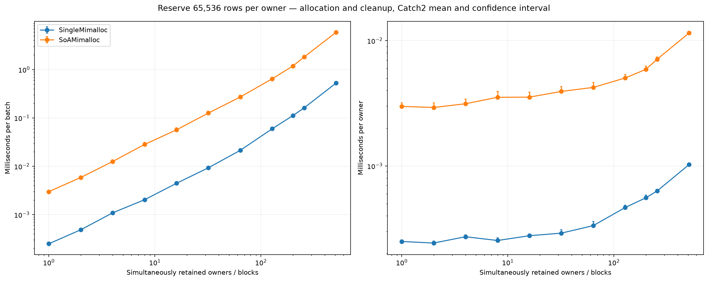
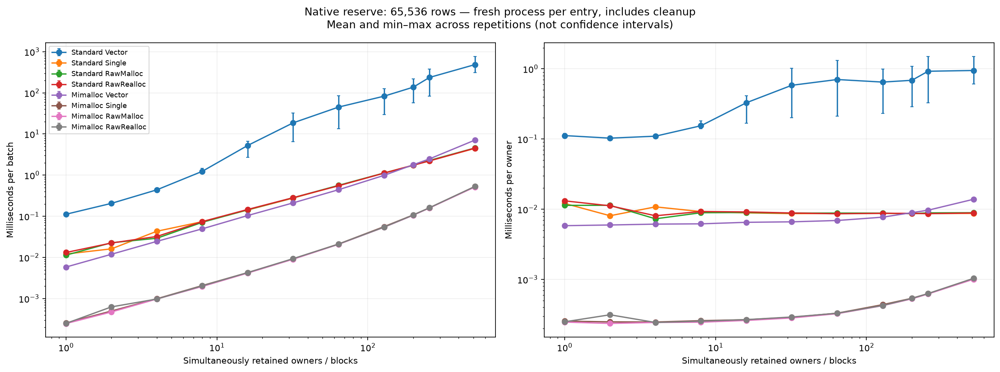

# Single-allocation SoA investigation report — 8 September 2026

**9 September update:** single-allocation generation now defaults to fixed
192-byte inter-column gaps, with further padding for stronger alignment. The
[iteration confirmation report](README.md#fixed-cpu-results-9-september-2026)
preserves the original TArray comparison and the fixed-CPU results. In the
fixed-CPU session, TArray wide iteration took 6.889 ms versus 1.409 ms for the
192-byte experimental layout: **4.89x faster, or 79.5% less time**, with 9,984
extra bytes. Narrow iteration improved by approximately 4%. The original
TArray measurements were 0.419 ms narrow and 6.938 ms wide; the original
extra-capacity workaround measured 0.396 ms and 1.324 ms respectively.
These are separate sessions; see the linked report for live counts, variability
and limitations. The historical allocator investigation below is unchanged.

## Outcome and scope

Keep the implementation experimental, with mimalloc as the default for the experimental Unreal single owner. The normal production generator and fighter storage are unchanged. With the same standalone mimalloc DLL on both sides, single-allocation reserve plus destruction was **10.6–13.9 times faster** than 53 TArrays across the owner sweep. The much slower FMemory single-block results tracked raw allocations and did not reproduce with direct mimalloc. This supports the representation, but does not establish a production simulation speedup.

The investigation is now closed as a broad allocator benchmark. The reserve comparison has been reduced to **two separately launched tests, one owner each, one reserve of 65,536 rows**: normal TArray-backed `EntityData` and default mimalloc-backed `SingleAllocationEntityData`. It no longer runs the 264 reserve matrix cases or allocation diagnostics. The full comparison workflow retains correctness and append, growth, resize, reset, removal, iteration and view timings, all at 65,536 rows using only TArray and Single/Mimalloc. The standalone Google Benchmark flows remain explicitly opt-in.

This report preserves the design, experimental progression, results and reconstruction instructions. The following implementation/measurement record was captured before simplifying the harness. **Commands and test names in that historical record describe the full investigation revision, not the current quick workflow.** Use the current [README](README.md) for everyday commands and the reconstruction section at the end for the old matrix. Historical `Single` means FMemory; `SingleMimalloc` means direct mimalloc. They must not be merged when processing results.

## Preserved measurements

The durable files below are copied from the actual local run outputs, not newly measured or reconstructed timings:

- [Unreal same-mimalloc measurements](results/unreal-mimalloc-layouts.csv): all 22 cases, mean and confidence bounds in nanoseconds, iterations and samples.
- [Unreal same-mimalloc plot](results/unreal-mimalloc-layouts.png).
- [Native eight-configuration matrix](results/native-reserve-matrix.csv): all eleven owner counts, milliseconds per complete batch.
- [Native matrix plot](results/native-reserve-matrix.png).
- [Earlier Unreal owner-count-isolated matrix](results/unreal-owner-isolated.csv): six configurations, milliseconds per batch. Implementations still shared a process within each owner count in this earlier run.

These are historical machine-specific results. The native JSON and complete console logs remain local in the paths recorded below; they are not required to read the preserved CSVs. No new timing run was made solely for the harness simplification.

## Implementation and measurement record
### Initial scope

This DeveloperTool module contains an opt-in storage experiment. Production fighter/entity code does not depend on it. `EntityData` and `SingleAllocationEntityData` are generated from the same experimental schema and share their exact `View` and `ConstView` types.

## Generator integration

The C++ generator's ordinary SoA lowering emits views and a `TArray`-backed owner. The optional schema field

```json
"experimental_single_allocation": {"name": "SingleAllocationEntityData"}
```

adds a sibling owner and its generated `<OwnerName>Storage` base. The base owns allocation state, layout constants, and typed column operations; the owner constructs the unchanged shared views. `StorageOperations` uses C++23 explicit-object parameters for common size and mutation control flow. Its minimum mutation API is always generated, independently of the ordinary owner's `operations` list. Owner-specific handwritten functions are not copied to the sibling. Shared view functions remain available.

Nested members must identify a generated schema in the same module:

```json
{"name": "locations", "kind": "nested", "type": "Vectors", "nested_schema": "Vectors"}
```

Declare children before parents. Flattening follows depth-first member declaration order, using the same traversal as fixed SoA storage. The existing `fixed_schema` configuration and fixed output are preserved. Opaque handwritten nested owners are rejected; nested ownership is never embedded in the experimental block.

The comparison schema mirrors the fighter schema's 32 top-level members and 53 leaves, including ten vector triples. Handle and enum equivalents preserve the original sizes. Countdown schemas preserve their leaf widths and nesting, but do not implement production countdown behavior. Production countdown views reference their owners, and ordinary tick countdowns also carry tick/cleaner state; this experiment does not claim compatibility with those concrete types or benchmark their gameplay logic.

## Layout and alignment

Capacity is always a multiple of 64, including zero. For leaf `T_i`, its block describes **64 contiguous elements**:

```text
A_i = max(64, alignof(T_i))
O_i = align_up(previous_block_end, A_i)
E_i = O_i + 64 * sizeof(T_i)
A   = max(all A_i)
B   = align_up(last E_i, A)
```

The allocation has alignment `A` and size `(capacity / 64) * B`. Leaf `i` starts at `data + (capacity / 64) * O_i` and holds `capacity` contiguous elements. This is column-major SoA, not an interleaving of 64-row chunks.

Every `O_i` is divisible by its alignment, so multiplying it by any integer block count preserves that alignment. Each next offset is at least the previous end; scaling both by the same block count preserves non-overlap and enough space for every column. Base alignment satisfies every leaf alignment. All alignment and offset information is compile-time; only scaling by capacity happens at runtime.

For ordinary types with alignment at most 64, every 64-element region is already a multiple of 64 bytes, so no inter-column padding is needed. Over-aligned types can require padding, including when a small leaf precedes them. Padding in this formulation scales with the number of capacity blocks. It is reported separately from row slack. There is no packing optimizer and no promise of minimal allocation size.

Compile-time checks reject invalid alignment/overflow and alignments that cannot fit the Unreal allocator argument. Runtime arithmetic checks limit capacity by both `int32` and addressable allocation size. Tests include odd-sized leaves and 32-, 64-, and 256-byte alignments.

## Lifetime and operations

The owner contains one pointer, one `int32` count, and one `int32` capacity. V1 is explicitly non-copyable. Moves transfer ownership and leave an empty reusable source; destruction frees the allocation.

Leaves must be complete, non-cv, non-array object types satisfying all of:

- `std::is_trivially_copyable_v<T>`
- `std::is_trivially_copy_constructible_v<T>`
- `std::is_trivially_destructible_v<T>`
- `std::is_nothrow_default_constructible_v<T>`

The extra trivial-copy-construction restriction provides a conservative implicit-lifetime subset. Trivial destruction alone is insufficient. Unreal's same-type relocation helper is deliberately not used as the capability test because it accepts more than this subset. Location-dependent invariants, such as self-pointers requiring fixup after relocation, are outside the contract.

The default Unreal single-allocation owner obtains aligned storage through `MimallocStorageAllocator` and frees it through the same allocator. The explicit `FMemorySingleEntityData` comparison uses `FMemory::Realloc(nullptr, bytes, alignment)`, matching the empty-allocation path used by TArray. Growth still allocates a separate block and relocates columns before freeing the old block; it does not realloc the existing capacity-dependent layout in place. Non-allocating placement construction of an uninitialized `std::byte` array establishes the storage-providing array and permits implicit creation of the supported leaf arrays. It performs no extra allocation or initialization loop. Bulk pointer builders use `std::launder`. Mutable and const pointers share one aggregate definition. Checked builders handle null storage once; private unchecked builders receive the block count and are used only with valid allocations. Separate offset and no-offset overloads avoid unnecessary offset arithmetic. Pointer aggregates are temporary and never cached in the owner; unallocated owners return null pointers without pointer arithmetic. The lifetime basis is the C++ object model's rules for starting byte-array lifetimes and implicit object creation, not an assumption that `reinterpret_cast` constructs objects. See [C++ object model](https://eel.is/c++draft/intro.object) and [new expressions](https://eel.is/c++draft/expr.new).

`add_uninitialised` checks the new row count once, grows if necessary, and updates the authoritative count. It does not initialize values; callers must write before reading them. `add_defaulted` and growing `set_num` use Unreal's `DefaultConstructItems<T>`, matching `TArray` zero-construction traits and default constructors. A trivially copyable handle with non-zero default member initializers is supported and tested.

`reserve` rounds the requested capacity without geometric slack. Append growth reuses `DefaultCalculateSlackGrow` with allocator byte quantization disabled, clamps to the maximum supported capacity, and rounds to 64. Growth allocates one new block, copies the active bytes of each leaf, frees the old block, and commits the new capacity. It temporarily owns both allocations and cannot exploit an in-place `Realloc` as individual `TArray`s sometimes can.

`reset`, resize-down, and `remove_at_swap` retain capacity. `EAllowShrinking` parameters are accepted for call compatibility and never trigger shrinking. Swap removal follows `TArray`'s range-removal row ordering. Deep copying, append/copy from views, and non-trivial relocation/destruction are deferred.

Views use the existing `get_view`/`get_const_view` names, including ranges and slice helpers. Column addresses are calculated when views are constructed. Growing capacity invalidates old views. The owner has no per-column size invariant; ordinary view validation remains available because views can still be constructed independently.

## Validation and measurement

Generator coverage uses existing GTest structural tests, the generated C++ compile fixture with the real experimental storage helper and Unreal API stubs, and expected compilation failures for unsupported copy/destructor/default-constructor types. Catch2 runtime tests use the real mimalloc-backed default owner and generated Unreal module, with FMemory-backed comparison types. They cover layout, boundaries, every leaf across repeated growth, mutation, default construction, moves, views, and arithmetic limits.

Build and run only this experiment from the repository root:

```powershell
cmake --workflow --preset single-allocation-soa-benchmark
```

The workflow configures and builds the Development benchmark target, then runs correctness, allocation diagnostics, and the timed comparison serially. CSV result rows are printed to the console, including successful runs. A final build step automatically generates PNG/SVG plots and extracted CSVs under `out/build/benchmark/single-allocation-soa-plots/` using `uv` and matplotlib. It uses the default 4,096, 65,536, and 1,048,576 entity counts. Stop competing workloads before running it. The latest test log is under `out/build/benchmark/Testing/Temporary/LastTest.log`.

To rerun without rebuilding:

```powershell
ctest --preset single-allocation-soa-benchmark
```

### Selecting individual operations for profiling

Each timing operation is a separate Catch2/CTest test under `SandboxCore.SingleAllocation.Timing.<operation>`. Each test compares both owners across the configured row counts, using Catch2 BENCHMARK_ADVANCED calibration and statistical analysis. Only the selected operation runs. Timing boundaries are described below.

Reserve only, including build and timing plots:

```powershell
cmake --workflow --preset single-allocation-soa-reserve
```

Rerun reserve without building or plotting:

```powershell
ctest --preset single-allocation-soa-reserve
```

Select another operation, or combine operations with a regex:

```powershell
ctest --preset single-allocation-soa-benchmark -R '^SandboxCore\.SingleAllocation\.Timing\.populated_growth$'
ctest --preset single-allocation-soa-benchmark -R '^SandboxCore\.SingleAllocation\.Timing\.(reserve_[0-9]+_owners_[0-9]+_[A-Za-z]+|populated_growth)$'
ctest --preset single-allocation-soa-benchmark --show-only
```

Operation suffixes are `natural_append_1`, `natural_append_64`, `reserved_append_1`, `reserved_append_64`, `defaulted_append_1`, `defaulted_append_64`, `reserve`, `populated_growth`, `set_num_grow`, `set_num_shrink_reuse`, `reset_reuse`, `remove_swap`, `iterate`, `iterate_wide`, and `construct_views`.

The full workflow still runs all timing operations plus correctness and allocation diagnostics. Each timing operation now runs in its own process, giving it a fresh allocator history instead of inheriting earlier operations' allocations. This can change timings relative to the original monolithic run. The Catch2 CSV format replaces the historical manual-timer format. Partial runs produce plots for the selected operations only; they do not contain allocation diagnostics unless those were selected too.

### Plotting results

To extract and plot reserve timings from saved results without manually filtering CSV:

```powershell
uv run Scripts/plot-single-allocation-soa-benchmarks.py --input .local/benchmarks/single-allocation/timings.csv --operation reserve --output-dir .local/benchmarks/single-allocation/reserve-plots
```

Repeat `--operation` to select multiple timing operations. The exported `timings.csv` contains only the selected operations. Allocation diagnostics, when supplied, remain unfiltered because they describe whole containers rather than timing operations.

The workflow generates plots automatically. To regenerate its plots without rerunning the benchmark:

```powershell
cmake --build --preset single-allocation-soa-plots
```

You can also invoke the matplotlib script directly:

```powershell
uv run Scripts/plot-single-allocation-soa-benchmarks.py
```

`uv` installs the script's declared matplotlib dependency in an isolated environment. Python 3.11+ is required. If matplotlib is already installed, `python Scripts/plot-single-allocation-soa-benchmarks.py` also works. Plotting is headless and does not run the benchmark again. Images are written through a temporary sibling file and replaced atomically. If an image viewer prevents replacement, a uniquely named image is retained and its path is printed; close the old image before rerunning to restore the usual filename.

By default the script reads `out/build/benchmark/Testing/Temporary/LastTest.log` and writes under `.local/benchmarks/single-allocation/plots/`:

- `timings.png` / `.svg`: per-operation Catch2 mean durations in milliseconds on logarithmic axes, with confidence bounds.
- `relative-performance.png` / `.svg`: TArray mean divided by single-allocation mean. Above 1 means single allocation is faster; below 1 means slower. Colour is symmetric in log space around equal performance.
- `allocations.png` / `.svg`: requested/usable storage, row slack, peak requested-byte bounds, capacity-changing requests, and retained allocations, split by row count and reserve mode.
- `timings.csv` and `allocations.csv`: extracted source records for later inspection or replotting.

CTest replaces its latest log on subsequent test runs. Save it before running other tests if you want to keep a measurement. A log containing only allocation diagnostics cannot produce timing plots. You can pass saved logs, captured verbose CTest console output, or the exported CSV files explicitly:

```powershell
uv run Scripts/plot-single-allocation-soa-benchmarks.py --input .local/benchmarks/single-allocation/timed-comparison.log .local/benchmarks/single-allocation/allocation-diagnostics.log --output-dir .local/benchmarks/single-allocation/plots
```

Use files from one measurement run. Conflicting duplicate results are rejected rather than silently combined. Timing-only inputs generate the two timing figures; allocation figures require allocation records. Missing operation/count combinations are left blank. Error bars show Catch2 confidence intervals for the mean (95% by default). Reserved append/resize durations exclude reserve cost but include resetting the logical size; uninitialised append does not write row contents. The allocation peak chart is a bound, not measured RSS.

Relevant commands, run from the repository root:

```powershell
cmake --workflow --preset codegen
cmake --build --preset generate-code
cmake --workflow --preset format-code
cmake --workflow --preset generate-project-files
cmake --workflow --preset debug-game
ctest --preset debug-game-unit-tests -L low-level-core --output-on-failure
cmake --preset benchmark
cmake --build --preset benchmark
ctest --preset benchmark-tests -R 'SingleAllocation.BenchmarkCorrectness' --output-on-failure
ctest --preset benchmark-tests -R 'SingleAllocation.AllocationDiagnostics' -V
```

After builds/setup finish and the user confirms that competing work has stopped:

```powershell
ctest --preset benchmark-tests -R '^SandboxCore\.SingleAllocation\.Timing\.' -V
```

The benchmark uses Development optimization with matching AVX2/precise floating-point settings. Default sizes are 4,096, 65,536, and 1,048,576 rows. Catch2 controls calibration, warmup, repetitions, samples, and bootstrap analysis. Owners run sequentially (TArray then Single), rather than alternating manual samples. Correctness is checked separately by BenchmarkCorrectness. A listener exports SOA_CATCH records containing count, operation, owner, mean/lower/upper nanoseconds, confidence level, iterations per sample, and sample count. The existing CMake plotting step consumes these records automatically. Historical manual logs are rejected because their measurement boundaries and statistics differ.

Append cases use the same non-inlined call boundary for both owners, with 1- and 64-row batches. Natural and reserve-first uninitialized append are measured separately; defaulted append uses pre-reserved capacity. Reserve now measures construction + reserve + destruction, without explicitly touching every page. Natural append also includes destruction. Populated growth measures the complete prepare + grow + destroy lifecycle, including initial allocation, defaulting and initialization; it is no longer an isolated growth measurement. This keeps memory bounded: preparing a separate 195 MiB owner for every calibrated repetition could exhaust memory. Reserved append/defaulting/set_num reuse one prepared owner and include reset before each repetition. Swap removal restores the logical row count inside timing before removing rows; row values are not reinitialized between repetitions. Normal-operation cases include defaulted `set_num`, swap removal, and amortized reset/resize-down reuse. The latter measure 4,096 **reset-plus-uninitialized-refill** or **shrink-one-plus-uninitialized-append** cycles; they are not reported as isolated reset/shrink costs. Divide their durations by 4,096 for cycle cost. Append throughput is `count / seconds`; removal throughput is `(count / 4) / seconds`.

Iteration reuses the same initialized owner across repetitions, so values accumulate. It calls the same non-templated function through identical view types, with view construction outside timing. It performs four passes; a wider case touches additional columns. View construction plus a shared non-inlined consumer is also measured across 4,096 calls. Generated ordinary owner mutations are out-of-line as in the current generator; the experimental fast path is inline. This is a comparison of the generated implementations, not an attempt to remove their API implementation costs.

Untimed allocation diagnostics track capacity changes as allocation requests, not physical heap allocations. They report retained blocks, requested/allocator-usable bytes, live bytes, row slack, layout padding, min/max column capacity, and owner size. Peak requested bytes are a conservative bound assuming each old leaf allocation remains live while its replacement is allocated. That bound is exact for the experimental owner; the baseline may use in-place reallocation. Allocator metadata/fragmentation and system RSS are not measured.

The initial Unreal run showed faster reserved append/reuse but substantial reserve and growth regressions; keep this experimental. Inspection of the optimized MSVC benchmark object confirms that the byte-array placement new emits no instructions. However, the earlier attribution to mimalloc's huge-allocation path overlooked Unreal's poisoning proxy. In `Engine/Source/Runtime/Core/Public/HAL/MallocPoisonProxy.h`, `Malloc` fills every requested byte with `0xcd`, whereas `Realloc(nullptr, size)` leaves `OldSize` at zero and skips the new-memory fill. TArray's allocator uses Realloc while the experimental owner used Malloc in that run. The Unreal experimental helper now also uses Realloc with a null pointer. Consequently an empty reserve through this proxy performs substantially different work: the single owner touches its entire block. `Free` also poisons allocations, affecting lifecycle timings.

`UE_USE_MALLOC_FILL_BYTES` normally enables the proxy in non-editor Debug/Development builds without ASan or a fixed GMalloc class. The benchmark's generated definitions confirm Development with `WITH_EDITORONLY_DATA=0`; the wrapper is installed conditionally in `Core/Private/HAL/UnrealMemory.cpp`. The diagnostic allocator name alone cannot establish whether poisoning is enabled because the proxy forwards `GetDescriptiveName()` to its underlying allocator. The code establishes the Malloc/Realloc asymmetry; quantifying its contribution still requires a controlled Unreal comparison with poisoning held consistent. The mimalloc object-size threshold may also matter, but the previous measurements did not isolate it from poisoning.

The placement new is retained to establish the storage-providing byte array and implicit-lifetime objects without relying on the implementation of Unreal's custom allocator. C++ does not require this particular spelling: standard allocation functions and C++23 lifetime-start facilities offer other routes. Removing it solely for speed is unsupported by the emitted code.

Generated modules opting into single-allocation storage run through clang-format before writing or checking outputs, using the nearest project `.clang-format`. Formatting failures leave existing outputs untouched. Other generator modes retain their existing formatting policy.

## Standalone standard-library experiment

This is an additional backend and benchmark executable. The Unreal types, Catch2 benchmarks, and workflows remain available.

Build and validate without running a performance comparison:

```powershell
cmake --workflow --preset native-soa
```

This builds the generator, generated native owners, Google Benchmark executable, and runtime tests. It runs correctness tests, one-iteration benchmark dry runs, and a JSON-to-plot smoke check. Dry-run timings are validation artifacts, not performance results.

Run the reserve comparison and generate plots after stopping competing workloads:

```powershell
cmake --workflow --preset native-soa-reserve
```

This compares both owners at 4,096, 65,536, and 1,048,576 rows, with nine randomly interleaved repetitions and a 0.1-second minimum measured duration per repetition. Results are saved to `out/build/native-soa/native-soa-results.json`; plots go to `out/build/native-soa/native-soa-plots/`. Google Benchmark JSON retains individual repetitions, aggregates, units, configuration context, and memory counters. The PNG plot shows means and min–max ranges across repetitions, not confidence intervals.

The standalone executable is `out/build/native-soa/native/lispb/native_soa/native-soa-benchmarks.exe`. It includes optimized debug symbols for profiling. To select cases directly in a profiler, use arguments such as:

```text
--benchmark_filter=Vector/reserve/65536/ --benchmark_min_time=5s
--benchmark_filter=Single/reserve/65536/ --benchmark_min_time=5s
```

Use `--benchmark_list_tests=true` to list cases. Other operation names include `populated_growth`, `defaulted_append_1`, `defaulted_append_64`, `reserved_defaulted_append_1`, `reserved_defaulted_append_64`, `set_num`, `reset_refill_16`, `remove_swap`, `iterate`, and `views_4096`. `reserved_uninitialised_append_1` exists only for Single; standard vector has no equivalent operation. Ordinary defaulted append uses vector resize and the single owner uses value construction, including Handle's default -1 values.

The generator accepts `experimental_stdlib: true` on an SoA module. It emits header-only vector owners and nested mutable/const span views. The native experiment's small generation driver reads the canonical Unreal experimental schema, projects integer names and leaf-type dependencies into standard C++, and selects this backend. Field order and nesting therefore come from the same source manifest. Generated output is under `out/build/native-soa/native/lispb/native_soa/generated/native_soa_types.h`; edit the manifest or generator rather than this build artifact.

Both backends use the existing flattened-layout generator and a shared standard-C++ layout/trait header. Capacity granularity remains 64; every column starts on at least a 64-byte boundary, raised for over-aligned leaves, and the base allocation satisfies the maximum alignment. Native runtime tests include alignments 32, 64, and 256, boundary capacities, non-overlap, data preservation, moves, default values, nested spans, removal, and checked arithmetic. The single owner retains the same trivial-copy/destruction and nothrow-default-construction restrictions and remains move-only. Native single growth uses 1.5x geometric growth rounded to 64; vector uses the standard-library implementation's growth policy.

The native backend supports reserve, reset, set_num, add_defaulted, remove_at_swap, and shared get_view APIs; the single owner also supports uninitialised append and sliced views. Fixed storage, equivalent types, custom generated functions, and vector<bool> are outside this backend's current scope. Native views share an API with each other, not a C++ type with Unreal TArrayViews. Vector owners use ordinary vector copy/move behavior; mutations across multiple columns are not transactionally rolled back after allocation failure. This prototype does not claim full parity with the ordinary Unreal generator.

Allocation uses standard aligned operator new/delete for Single and normal std::vector allocation for Vector. The active native compiler/STL and allocator differ from the Unreal configuration, so native timings must not be treated as measurements of FMemory/Mimalloc. The current preset uses Release optimization, precise floating-point operations, AVX2, and debug information on the benchmark target.

Reserve and populated growth exclude fixture setup and final destruction using Google Benchmark pause/resume timing; append excludes resetting or destroying the previous fixture. Growth starts with initialized live rows and requests 2 * count + 1 capacity. Memory stays bounded to one fixture per executing case. Timing transitions occur once per whole container operation, not per row; very short operations can still be affected by framework overhead. Iteration uses identical span-based source code on initialized owners, and values accumulate between repetitions. Swap removal restores the row count outside timing but does not restore removed values. Reset/refill measures 16 defaulted refill cycles; views measures 4,096 constructions. These boundaries differ from the Catch2 lifecycle benchmarks.

JSON counters report retained capacity bytes, retained allocations, live bytes, unused bytes (including layout padding), and owner size. They do not count heap calls, allocator metadata, transient growth peaks, or resident memory. Throughput counts rows for append/iteration, removed rows for removal, requested rows for reserve, refilled rows for reset/refill, and view constructions for views.

To replot saved JSON:

```powershell
uv run Scripts/plot-native-soa-benchmarks.py --input out/build/native-soa/native-soa-results.json --output-dir out/build/native-soa/native-soa-plots
```

The confirmed native reserve run on 2026-09-08 used nine randomly interleaved repetitions. Mean wall times were:

| Rows reserved | Vector | Single | Vector / Single |
|---:|---:|---:|---:|
| 4,096 | 8.727 us | 0.242 us | 36.0x |
| 65,536 | 47.945 us | 2.976 us | 16.1x |
| 1,048,576 | 149.159 us | 3.330 us | 44.8x |

Requested storage matched at every count; retained allocations were 53 versus 1. These are empty-reserve measurements with cleanup excluded and no explicit row initialization. They establish that the large Unreal reserve regression did not reproduce in this native configuration, not that allocation cost is independent of allocator configuration or page touching. Local JSON and PNG artifacts are under the paths above and are not committed.
After changing the Unreal helper to `FMemory::Realloc(nullptr, bytes, alignment)`, the reserve-only Catch2 test was rerun on 2026-09-08 (100 samples per owner/count). Mean **reserve plus destruction** times were:

| Rows reserved | TArray | Single |
|---:|---:|---:|
| 4,096 | 5.025 us | 5.635 us |
| 65,536 | 109.293 us | 1,595.225 us |
| 1,048,576 | 26.074 ms | 22.982 ms |

Build, generated compile smoke, and all 64 benchmark-correctness assertions passed. The current Catch2 measurement includes `Free`, which still poisons allocated storage; it is not the isolated-reserve measurement used by the original manual timer or native Google Benchmark. Thus this run does not quantify the isolated benefit of skipping Malloc poisoning. The remaining 65,536-row lifecycle regression requires separating allocation from poisoned cleanup before attributing it to reserve. The captured log is `.local/benchmarks/single-allocation/unreal-realloc-reserve.log`, and current PNG plots are under `out/build/benchmark/single-allocation-soa-plots/`.


Unreal reserve cases are individually selectable as `SandboxCore.SingleAllocation.Timing.reserve_<rows>_owners_<owners>_<implementation>`, for example `SandboxCore.SingleAllocation.Timing.reserve_65536_owners_200_TArray`. There are 264 tests: three row counts times eleven owner counts times eight implementations. The reserve preset selects all 264; use `ctest --preset single-allocation-soa-reserve -R reserve_65536` for just that size. These cases use their named row count rather than the CLI count override. CSV operation labels are now `reserve_<owners>`, keeping the batch measurements separate from historical single-owner `reserve` results. Timing and allocation CSV output lives in `single_allocation_soa_results.cpp`; benchmark dispatch takes the operation enum, row count, and append batch size directly.

Separate Unreal reserve tests measure **1, 2, 4, 8, 16, 32, 64, 128, 200, 256, and 512 owners**, stored in a dynamically sized `std::vector`. The matrix script and CTest launch each row-count/owner-count/implementation test in a fresh process. TArray, Single, SingleMimalloc, SoAMimalloc, RawMalloc, RawRealloc, SoAMalloc, and SoARealloc therefore run separately, with no process-local allocator state carried between them. Catch2 calibration and samples still share state within each individual benchmark. Selecting multiple tests directly with an executable wildcard runs them in one process; use the script or CTest for the isolated sweep. The outer vector allocation and destruction are included. The loop reserves the named row count in every owner before any owner is destroyed, retaining `owners * 53` column allocations for each TArray-based representation versus `owners` for Single. Each Catch2 invocation includes the complete allocation loop and subsequent destruction; reported times are for the whole batch. Divide by the owner count for amortized time per owner. For 200 owners, at 65,536 rows this retains about 2.38 GiB of requested payload; at 1,048,576 rows it retains about 38.1 GiB, before allocator overhead. These measurements test allocation under a larger retained workload; they do not by themselves establish whether allocator pools caused the earlier difference.

Each Unreal reserve case also reports `RawMalloc`, `RawRealloc`, `SoAMalloc`, and `SoARealloc` in Catch2 console output. The raw cases allocate all blocks in the batch before freeing any of them. The SoA references are generated `MallocEntityData` and `ReallocEntityData` owners: every leaf TArray, including the vector/countdown children, uses the selected dumb allocator. They use the same schema, field order, and generated operations as the ordinary owner. The earlier single-byte-array references have been removed.

The experimental manifest's `experimental_array_allocators` entries specify a type prefix and allocator type reference. The generator clones dynamic schemas and their nested references, then emits ordinary TArray-backed owners through the existing generator with an explicit allocator template argument. This is opt-in; production schemas are unchanged, and the native stdlib projection excludes the Unreal allocator variants.

Both reference allocators reuse Unreal's sized allocator base, reserve exact requested element capacities without allocator quantization, and enforce at least 64-byte alignment (higher for over-aligned leaves). The Malloc allocator handles resizing with Malloc/copy/Free; the Realloc allocator uses Realloc. Each SoA reserve allocates 53 column blocks. Raw references allocate one block of the full single-owner byte count at its required alignment. All these timings include Free/destruction and any active poisoning. All six implementations are exported in `reserve-records.csv` (including confidence bounds), `reserve-matrix-<rows>.csv` (batch means in milliseconds), and `reserve-matrix-<rows>.png` (batch and amortized times). Existing two-owner plots remain available. The CMake plot workflow generates these matrix artifacts automatically when the input log includes reserve batches.
Build with `cmake --build --preset benchmark`, then run and plot the 65,536-row matrix with:

```powershell
./Scripts/run-soa-reserve-matrix.ps1 -Rows 65536 -Samples 10
```

The script saves the log and plots under `.local/benchmarks/single-allocation/reserve-matrix-per-implementation/`. The 512-owner batch holds about 6.09 GiB at 65,536 rows (97.5 GiB at 1,048,576 rows); choose the row count with available memory in mind.

The native reserve matrix is an additional Google Benchmark flow:

```powershell
cmake --workflow --preset native-soa-reserve-matrix
```

It builds and tests both allocator configurations, runs 65,536 rows at all eleven owner counts, then writes JSON, CSV and PNG under `out/build/native-soa/native-soa-reserve-matrix/`. To rerun only measurements and plots after building, use `cmake --build --preset native-soa-reserve-matrix`.

Every matrix entry starts a fresh process: four implementations (Vector, Single, RawMalloc, RawRealloc) times two allocator configurations times eleven owner counts = 88 processes. Each process runs ten Google Benchmark repetitions with a 0.1-second minimum calibration target. Each measured iteration allocates a dynamically sized outer vector, reserves all owners/blocks, retains the complete batch, and destroys it. No rows are explicitly written. Plots show batch and amortized means with min–max repetition ranges, not confidence intervals. CSV cells are mean milliseconds per batch. JSON preserves each process's full Google Benchmark results and context. Calibration and repetitions still reuse allocator state within that process; process isolation does not make every allocation cold or reset OS page state. Random interleaving is unnecessary within a process containing one benchmark; the runner uses a fixed process order.

The standard configuration uses normal `std::vector` allocation and aligned C++ new/delete for Single; the Windows CRT `_aligned_malloc` and `_aligned_realloc(nullptr, ...)` provide raw references. The mimalloc configuration uses vcpkg mimalloc 3.5.0 through explicit allocators: generated vectors use an alignment-aware allocator calling `mi_new_aligned`/`mi_free`, Single uses `mi_new_aligned`/`mi_free_aligned`, and raw references use `mi_malloc_aligned` or `mi_realloc_aligned(nullptr, ...)` with `mi_free`. These follow mimalloc's [aligned allocation API](https://microsoft.github.io/mimalloc/group__aligned.html) and [C++ allocation API](https://microsoft.github.io/mimalloc/group__cpp.html). The native generator emits a `native_soa::Vector<T>` alias that remains `std::vector<T>` by default. The mimalloc target defines `NATIVE_SOA_MIMALLOC=1`; compile each executable consistently because this changes generated member types. Nested columns use the same alias. The harness and outer owner/pointer vector retain their standard allocator in both configurations; no global allocator override is installed.

This standalone mimalloc build has no Unreal poison proxy, does not intentionally fill reserved bytes, and is not equivalent to Unreal's mimalloc version/configuration. The experiment compares allocation and cleanup behavior, not page-write throughput. The existing native reserve benchmark and its measurement boundaries are unchanged.

To select a smaller native matrix or replot:

```powershell
uv run Scripts/run-native-soa-reserve-matrix.py --standard out/build/native-soa/native/lispb/native_soa/native-soa-reserve-matrix.exe --mimalloc out/build/native-soa/native/lispb/native_soa/native-soa-reserve-matrix-mimalloc.exe --rows 65536 --owners 1 200 512 --output-dir .local/benchmarks/native-soa-matrix
uv run Scripts/run-native-soa-reserve-matrix.py --plot-only --output-dir out/build/native-soa/native-soa-reserve-matrix
```

The native CTest preset exercises both allocator variants with the existing runtime tests, verifies alignment (including 256-byte leaves) and mimalloc pointer provenance, and runs a 16-process dry-run/JSON/CSV/plot smoke check. Dry-run plots are labelled and must not be used as timing results.
The 2026-09-08 run with a fresh process for every implementation/owner-count pair used 65,536 rows, all eleven owner counts, ten Catch2 samples per Unreal case and ten Google Benchmark repetitions per native case. Selected **512-owner batch means, including cleanup**, were:

| Configuration | TArray / Vector | Single | Raw Malloc | Raw Realloc |
|---|---:|---:|---:|---:|
| Unreal | 371.107 ms | 878.585 ms | 1,126.828 ms | 858.076 ms |
| Native standard allocator | 484.963 ms | 4.463 ms | 4.567 ms | 4.526 ms |
| Native mimalloc 3.5.0 | 7.094 ms | 0.528 ms | 0.515 ms | 0.529 ms |

Unreal's explicit Malloc/Realloc SoA variants measured 683.259/360.977 ms at 512 owners. Single continues to track the corresponding raw single-block allocation closely. Isolating implementations did not remove the Unreal regression. Native mimalloc Single was about 13.4 times faster than its Vector counterpart; the regression therefore does not reproduce in this standalone mimalloc configuration. These results do not isolate the poison proxy from other Unreal allocator/version/build differences. Allocator calibration remains warm within each process and the native standard Vector repetitions show substantial variation; consult the plotted ranges and raw JSON rather than treating these means as universal costs.

Unreal artifacts are under `.local/benchmarks/single-allocation/reserve-matrix-per-implementation/`; native artifacts are under `out/build/native-soa/native-soa-reserve-matrix/`. Both include all owner counts in CSV and PNG. The existing owner-count-only isolated results remain in their separate earlier directory for comparison.
Unreal also has a direct mimalloc single-allocation variant, `SingleAllocationEntityData` (benchmark label `SingleMimalloc`), and `SingleAllocationAlignmentData` for runtime validation. It shares the original owner's views, flattened layout, capacity policy and lifetime operations. The schema's `experimental_single_allocation.variants` array adds named owners with an allocator type implementing `allocate(bytes, alignment)` and `free(data)`; all allocation/free sites, including growth and move assignment, use that allocator. The native projection omits these Unreal-specific variants.

`MimallocStorageAllocator` calls the vcpkg 3.5.0 DLL directly through `mi_malloc_aligned`/`mi_free`. Unreal already defines mimalloc symbols, so the experiment stages this DLL as `sbx-mimalloc.dll` and loads its exports explicitly from the executable directory, avoiding import-library symbol collisions. It retains the DLL for process lifetime. The engine's global allocator is unchanged; only this owner's backing block bypasses FMemory and its poison proxy. Outer benchmark vectors still use Unreal's normal C++ allocation. The standard `Single` case remains FMemory-backed. CMake's Unreal presets provision the shared `soa-mimalloc` vcpkg feature, and UBT stages the DLLs through `SbxCoreExperiments.Build.cs`.

Run a focused 200-owner comparison and generate its plots with:

```powershell
./Scripts/run-soa-reserve-matrix.ps1 -Rows 65536 -Owners 200 -Samples 10
```

Or select the new benchmark directly: `SandboxCore.SingleAllocation.Timing.reserve_65536_owners_200_SingleMimalloc`. The runtime correctness suite exercises its growth, defaulting, views and operations, plus 32/64/256-byte alignment, pointer provenance, reset and move ownership.
The focused Unreal comparison on 2026-09-08 (200 owners, 65,536 rows, ten samples, one process per implementation, cleanup included) measured TArray **126.973 ms**, FMemory Single **318.656 ms**, and direct SingleMimalloc **0.115195 ms** per batch. SingleMimalloc's 95% confidence interval was 0.105175–0.153625 ms; its mean is close to the native mimalloc batch mean of 0.107765 ms. This strongly points toward costs in the Unreal allocation/free path rather than the generated layout. It bypasses the poison proxy but also changes mimalloc version/configuration, so it is not a controlled poisoning-only comparison. Runtime validation passed 503 assertions, including mimalloc pointer provenance.
The final allocator comparison adds `MimallocArrayAllocator` and generated `MimallocEntityData` (benchmark label `SoAMimalloc`). All 53 TArrays use the same vcpkg mimalloc DLL as `SingleMimalloc`. `CallRealloc` calls `mi_realloc_aligned` with at least 64-byte alignment; `CallFree` calls `mi_free`, and resizing to zero also uses `CallFree`. Reserve requests exact capacities, matching the existing reference allocators. Unreal's sized allocator base still handles TArray's ownership and growth interface. The owner and its nested arrays are generated by the existing allocator-variant path.

To compare only the two mimalloc-backed layouts in fresh processes across every owner count:

```powershell
./Scripts/run-soa-reserve-matrix.ps1 -Rows 65536 -Samples 100 -Implementations SingleMimalloc,SoAMimalloc -OutputDirectory .local/benchmarks/single-allocation/mimalloc-layout-comparison
```

The plot script accepts reserve subsets without requiring the original TArray/Single pair. Both layouts retain the complete batch before cleanup. This isolates the layout comparison from the Unreal FMemory poison proxy, although TArray and Single retain their different allocation APIs (Realloc versus Malloc) and column-address alignment. The correctness suite covers default construction, preserved values through reserve/reallocation, aligned nested columns, allocator provenance, move assignment over existing allocations, reset and emptying.
The final same-mimalloc Unreal sweep on 2026-09-08 used 65,536 rows, all eleven owner counts, 100 Catch2 samples and a fresh process per case. Mean reserve-plus-destruction batch times were:

| Owners | SingleMimalloc | SoAMimalloc (53 TArrays) | Single speedup |
|---:|---:|---:|---:|
| 1 | 0.000250 ms | 0.002987 ms | 12.0x |
| 200 | 0.111353 ms | 1.179429 ms | 10.6x |
| 512 | 0.525274 ms | 5.896735 ms | 11.2x |

Single was 10.6–13.9 times faster across the full sweep. Both implementations allocate and free through the same DLL; neither passes backing-block cleanup through FMemory. At 200 owners the comparison retains 200 blocks versus 10,600 column blocks before destruction. The matrix PNG, CSV, confidence bounds and per-process logs are in `.local/benchmarks/single-allocation/mimalloc-layout-comparison/`.

This closes the allocator comparison: the single-allocation representation has a substantial reserve/lifecycle advantage when both layouts use standalone mimalloc. The earlier FMemory regression is not evidence against the layout itself. Keep the implementation experimental; these empty-reserve measurements include allocator reuse during calibration, do not explicitly write rows, and do not establish production simulation performance or isolate the poison proxy from every Unreal allocator difference. Production adoption should depend on end-to-end measurements in the intended build configuration. The final build, 642 Unreal correctness assertions, all 16 native/codegen CTest entries, formatting and Pyright passed.
Mimalloc is now the default for generated experimental Unreal single-allocation owners. `SingleAllocationEntityData` and `SingleAllocationAlignmentData` use it without a suffix or additional configuration. The former separately named mimalloc owners were removed; explicit `FMemorySingleEntityData` and `FMemorySingleAlignmentData` variants retain the old allocation path. Benchmark labels deliberately retain their established meanings: `Single` means the explicit FMemory comparison and `SingleMimalloc` means the default mimalloc owner. Allocation diagnostics also use the explicit FMemory type so they never query mimalloc pointers through FMemory.

The normal production Unreal generator remains one TArray-backed implementation. Its experiment-only allocator expansion generates default, Malloc, Realloc and mimalloc owners using that same implementation. Single-allocation owners share one lowering implementation with selectable allocation/free calls. There is generated repetition for comparison types, but no independent generator fork per allocator. The separate native stdlib lowering and its allocator defaults are unchanged.
## Consolidated findings and experimental progression

### Generator and implementation map

| Concern | Repository location |
|---|---|
| Canonical fighter-equivalent schema and allocator variants | `lispb/schema/single_allocation_experiment.lispb`, `types.lispb` |
| Normal Unreal owner and allocator expansion | `native/lispb/src/soa_lowering.cpp` |
| Single-allocation emission, shared by Unreal/native and allocator variants | `native/lispb/src/single_allocation_soa_lowering.cpp` |
| Reused nested flattening | `native/lispb/src/fixed_soa_layout.cpp` |
| Existing fixed lifetime design inspected for future extension | `native/lispb/src/fixed_soa_storage_lowering.cpp`, `Plugins/SandboxCore/Source/SandboxCore/Public/SandboxCore/fixed_storage.h` |
| Common runtime control flow and explicit FMemory allocator | `Public/SandboxCore/single_allocation/operations.h`, `Public/SandboxCore/single_allocation/allocators.h` |
| DLL loading and direct mimalloc allocation/free | `Private/mimalloc_storage_allocator.cpp` |
| TArray Malloc/Realloc/mimalloc adapters | `Public/SbxCoreExperiments/soa_reference_allocators.h` |
| Generated Unreal owners and views | `Public/SbxCoreExperiments/soa_types.h`, `Private/soa_types.cpp` |
| Native projection, runtime and benchmarks | `native/lispb/native_soa/` |
| Catch2 benchmark and separate CSV/diagnostics translation unit | `Plugins/SandboxCore/Tests/SandboxCoreBenchmarks/Private/single_allocation_soa_*.cpp` |

Paths without a repository prefix in this table are relative to this experimental module. The existing FBlockAllocator was inspected, but its ownership model and large-page/VirtualAlloc2 experiments were not needed. No allocator refactor or large-page support was introduced.

Readability work accompanied the prototype: `size_type` and maximum-size constants replaced repeated numeric limits; bytes-to-copy are computed once per distinct leaf type; capacity blocks and all data pointers are computed together; nullable and unchecked pointer construction are separated; zero-offset overloads avoid adding zero. Generated storage owns allocation/resizing and the owner constructs views, with C++23 explicit-object-parameter operations sharing control flow. Static assertions are collected in foldable consteval validation, and code generation formats this output before writing it. These changes reduce generated repetition without adding per-entity address calculations.

### Why the benchmark changed repeatedly

1. The first experiment covered append, reserve, growth, defaulting, resize, removal, reset, view construction and iteration using manual timing. It exposed reserve regressions but mixed costs that needed closer inspection.
2. Timing moved to Catch2 `BENCHMARK` / `BENCHMARK_ADVANCED`, with a separate listener/export translation unit and individually selectable tests for profiling. Statistical definitions and some fixture boundaries changed; early medians are not interchangeable with later means.
3. Raw Malloc/Free and Realloc-null/Free references showed that much of the single-owner time followed the allocator lifecycle. Explicit Malloc and Realloc TArray adapters were then applied to the **complete 53-column SoA**. A single byte-array comparison was insufficient and was replaced.
4. Keeping 200 owners alive until the end of each invocation tested whether immediate allocation reuse concealed costs. A dynamic vector enabled the sweep over 1, 2, 4, 8, 16, 32, 64, 128, 200, 256 and 512 owners. The outer vector and cleanup were inside timing.
5. The sweep was separated first by owner count, then by implementation as well. A fresh executable per matrix cell prevented one implementation from inheriting the previous implementation's allocator state. Catch2 calibration still warmed each process internally.
6. The independent stdlib/Google Benchmark backend tested the same schema outside Unreal. It provided JSON, random interleaving for the original native reserve comparison, and isolated-process matrices for the allocator investigation.
7. Direct mimalloc was added to native Vector and Single, then Unreal Single, then every TArray leaf. This last comparison used the same DLL for both layouts and closed the major allocator confound.
8. The full matrix had grown to 3 row counts × 11 owner counts × 8 implementations = **264 reserve test cases**, in addition to normal-operation timings. It was useful for investigation but inappropriate as a routine workflow. The current harness retains two one-owner reserve cases and the normal-operation timings at one row count with two representations; mutation correctness remains available.

Fresh processes are not cold OS state: committed pages, OS caches, other workloads and allocator warmup can still affect timings. A large batch tests simultaneously retained allocations, not merely more timing samples. At 65,536 rows, one owner's requested payload is 12,779,520 bytes; 200 owners request 2.38 GiB and 512 request 6.09 GiB. The old largest matrix cell (1,048,576 rows × 512 owners) requested 97.5 GiB before allocator overhead. This explains why selecting the broad CMake preset became impractical.

### Earlier operation results and slack

The [initial manual timing CSV](results/initial-manual-timings.csv) preserves all 45 measurements, including medians and p10/p90 in nanoseconds. These belong to the initial FMemory experiment and its old timing boundaries, before Catch2 and the allocator fixes; the current plot reader deliberately rejects that historical format. Selected 65,536-row **medians**, in milliseconds, were:

| Operation | TArray | Initial FMemory Single |
|---|---:|---:|
| Natural append, one row per call | 4.7351 | 7.7580 |
| Reserved append, one row per call | 3.8475 | 0.0707 |
| Defaulted append, one row per call | 6.9422 | 10.6260 |
| Defaulted append, batches of 64 | 0.8835 | 0.5911 |
| Populated growth | 0.6836 | 3.6988 |
| Set-num grow | 0.1631 | 0.2834 |
| Remove-at-swap | 2.2847 | 2.9095 |
| Iteration | 0.5019 | 0.4636 |
| Wider iteration | 6.6830 | 7.5605 |
| View-construction workload | 0.3359 | 0.1259 |

These results support investigating the cheap reserved-append path, but defaulting/removal/growth were not uniformly faster. Iteration was broadly comparable and noisy; it is not evidence for a consistent cache benefit. There has not been a final comprehensive rerun of these operations with the default mimalloc owner. Do not infer their current performance from the reserve sweep.

[Initial allocation diagnostics](results/initial-allocation-diagnostics.csv) preserve all twelve configurations. These measured the FMemory owner, not the new default mimalloc allocation. At 65,536 rows:

| Metric | TArray natural | Single natural | TArray reserved | Single reserved |
|---|---:|---:|---:|---:|
| Capacity per column | 74,344 | 85,440 | 65,536 | 65,536 |
| Capacity-changing requests | 1,272 | 20 | 53 | 1 |
| Retained blocks | 53 | 1 | 53 | 1 |
| Requested bytes | 14,497,080 | 16,660,800 | 12,779,520 | 12,779,520 |
| Allocator-usable bytes | 14,807,000 | 16,777,216 | 13,135,872 | 13,631,488 |
| Row slack bytes | 1,717,560 | 3,881,280 | 0 | 0 |
| Owner bytes | 848 | 16 | 848 | 16 |

Quantization and geometric growth do not guarantee lower slack at every size. At 1,048,576 naturally appended rows, Single instead had 8,661,120 slack bytes versus TArray's 50,359,920. This is growth-policy position, not a universal ratio. The 195-byte schema needs no layout padding at these capacities. Allocator-usable bytes and row slack are different measures; allocation requests count capacity transitions, not necessarily new physical heap blocks. RSS, fragmentation and allocator metadata were not measured. Single growth holds old and new blocks simultaneously, while TArray can sometimes realloc in place; the saved peak bounds must be interpreted accordingly.

### The allocator conclusion

The Unreal Malloc poison proxy's allocation fill and free fill explain why 'some arithmetic and one allocation' can include work proportional to many megabytes. Switching the single owner to Realloc-null removed the asymmetric initial Malloc fill, but did **not** eliminate the lifecycle regression. The raw Realloc comparison and later isolated processes confirmed that it was not primarily the column-offset math or placement new.

The direct mimalloc integration initially encountered duplicate symbols (`LNK2005`) because Unreal already supplies mimalloc functions. The successful integration does not link the vcpkg import library into those same symbols. `SbxCoreExperiments.Build.cs` stages vcpkg's DLL as `sbx-mimalloc.dll` with its redirect dependency; the wrapper loads that exact file from the executable directory and resolves aligned malloc/realloc/free and pointer-provenance exports. The DLL is retained for process lifetime. Debug CRT configurations select the corresponding debug DLL. CMake enables the `soa-mimalloc` vcpkg feature and project files were regenerated after the module-rule changes.

A native global new/delete override was also abandoned after a heap failure during the Google Benchmark dry run. Explicit allocator selection keeps ownership local: vector leaves use the mimalloc adapter, Single uses the matching allocation/free helper, and framework/outer-vector allocations retain their normal allocator. The native adapter explicitly requests alignment, including the 256-byte test type. No global Unreal allocator replacement is involved.

Direct mimalloc simultaneously bypasses the FMemory proxy and changes allocator build/version/configuration. Consequently the data strongly implicate the Unreal allocation/free path, but do not quantify the poison proxy alone. Calling `GetDescriptiveName()` cannot resolve that because the proxy forwards the underlying allocator name.

### Full final same-mimalloc result

All rows below reserve 65,536 elements per owner and include batch destruction. Each matrix cell used a fresh Unreal executable and 100 Catch2 samples. Values are **milliseconds per complete batch**, not per owner.

| Owners | SingleMimalloc | SoAMimalloc |
|---:|---:|---:|
| 1 | 0.000249692 | 0.002987 |
| 2 | 0.000485424 | 0.005859667 |
| 4 | 0.001089875 | 0.0125475 |
| 8 | 0.002034125 | 0.028255 |
| 16 | 0.00444225 | 0.056674 |
| 32 | 0.009316 | 0.125943 |
| 64 | 0.021392 | 0.271088 |
| 128 | 0.059688 | 0.644791 |
| 200 | 0.111353 | 1.179429 |
| 256 | 0.161656 | 1.81948 |
| 512 | 0.525274 | 5.896735 |



At 200 owners the Single mean's 95% interval was 0.109106–0.117001 ms versus 1.158185–1.250491 ms for the mimalloc TArrays. At one owner Catch2 calibrated 65 Single invocations per sample: the 0.250-microsecond result is an allocator-reuse throughput measurement, not a claim that freshly backed physical memory can be supplied at that rate. Neither layout explicitly writes all reserved rows.

The [native matrix CSV](results/native-reserve-matrix.csv) contains all 88 mean measurements. Each cell used ten Google Benchmark repetitions with a 0.1-second minimum measured time per repetition. These plots show min/max repetition ranges rather than Catch2 confidence intervals:



### Reconstruction recipe

The full Unreal matrix, custom allocator variants, scripts, native matrix and mimalloc linkage are preserved together at commit **`0cf0a26c` (`Complete isolated SoA allocator comparisons with mimalloc`)**. Use a separate worktree rather than overwriting the simplified benchmark:

```powershell
git worktree add ../soa-investigation 0cf0a26c
Set-Location ../soa-investigation
cmake --preset benchmark
cmake --build --preset benchmark
ctest --preset benchmark-tests -R 'SingleAllocation.BenchmarkCorrectness' --output-on-failure
```

Prerequisites are this repository's Windows CMake/Ninja/Unreal setup, the configured UE5.8 installation, MSVC, vcpkg and uv. The Unreal run used Development optimization, AVX2 and precise floating point, Catch2 3.11.0 and vcpkg mimalloc 3.5.0. The native build used Release with clang 21, AVX2/precise floating point and Google Benchmark 1.9.5. Preserve generated compile definitions, JSON context, compiler/engine versions, available memory and concurrent workload information when repeating; exact timings are not portable between machines or allocator configurations.

After build/setup and stopping competing work, reproduce the decisive Unreal experiment at that revision:

```powershell
./Scripts/run-soa-reserve-matrix.ps1 -Rows 65536 -Samples 100 -Implementations SingleMimalloc,SoAMimalloc -OutputDirectory .local/benchmarks/single-allocation/mimalloc-layout-comparison
```

For all eight allocator configurations, omit `-Implementations` and use `-Samples 10`. For a small diagnostic subset, use `-Owners 1,200,512`. Every cell launches its exact Catch2 test name in a fresh process; it records stdout before invoking the matplotlib script. Do not use the full CMake timing filter unless you intentionally want all three row counts and all owner counts.

At that historical revision the direct mimalloc owner is named `MimallocEntityDataSingle`; the later default switch renamed it to `SingleAllocationEntityData` and retained `FMemorySingleEntityData` as the explicit old path. Benchmark labels retain the allocator meanings described above, so the historical scripts still select the intended configurations.

The native flow remains available in the current tree as well as that revision:

```powershell
cmake --workflow --preset native-soa
# Timed, explicitly opt-in:
cmake --workflow --preset native-soa-reserve-matrix
```

To recreate the original randomly interleaved reserve-only comparison (cleanup excluded), use `cmake --workflow --preset native-soa-reserve`. To recreate the eight-configuration lifecycle matrix, use the matrix workflow above. They are different experiments. `Scripts/run-native-soa-reserve-matrix.py` accepts `--owners`, `--rows`, `--repetitions`, `--dry-run` and `--plot-only` for focused execution and reproducible JSON/CSV/PNG generation. Do not compare a dry-run timing with a measured run.

For source history before the full matrix, `f54bfa18` contains the initial prototype, `73d36ab3` the foldable assertions, `b8cca1d5` the initial native backend, and `042e0fa3` the Realloc change and split reserve/export work. The captured early manual CSV predates the final benchmark methodology; restore the relevant historical harness before attempting to reproduce its timing boundaries.

### Validation and remaining limits

The investigation's validation included structural codegen tests, compile smoke and rejection fixtures, real Unreal runtime tests and both native allocator variants. Cases cover empty storage; 1/63/64/65/127/128/129 boundaries; repeated growth; column order, non-overlap and alignment through 256 bytes; every leaf's data preservation; default construction; reset and grow/shrink; swap removal; move construction/assignment; nested mutable/const views; pointer provenance; arithmetic bounds; and unsupported lifetimes. The final full investigation passed 642 benchmark-correctness assertions and 16 native/codegen CTest entries; seven dedicated Unreal storage runtime tests also passed after switching the default to mimalloc. No sanitizer run is claimed.

For the simplification, the Development benchmark build and existing correctness test passed again. CTest discovery selects exactly two reserve tests in the reserve preset; the full preset additionally selects correctness and fourteen normal-operation timing tests. Pyright and formatting passed, and the two-bar PNG path was validated from saved measurement logs; that plot validation is not a new comparison result.

The recommendation is to retain and selectively extend the experiment, not begin production migration yet. Before adoption, measure populated growth and realistic simulation iterations with row writes, the intended shipping allocator configuration and representative entity lifetimes. Deep copy/append-from-view, non-trivial lifetimes, shrink-to-fit and large pages remain deferred. The shared view API and conservative trivial-leaf contract provide a useful foundation without requiring that work now.
